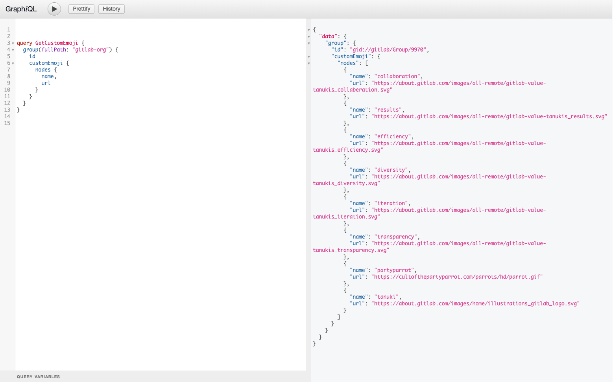

# Use custom emojis with GraphQL **(FREE)**

> - [Introduced](https://gitlab.com/gitlab-org/gitlab/-/merge_requests/37911) in GitLab 13.6
> - [Deployed behind a feature flag](../../user/feature_flags.md), disabled by default.
> - Enabled on GitLab.com.
> - Recommended for production use.
> - To use in GitLab self-managed instances, ask a GitLab administrator to [enable it](#enable-or-disable-custom-emoji-api). **(FREE SELF)**

This in-development feature might not be available for your use. There can be
[risks when enabling features still in development](../../administration/feature_flags.md#risks-when-enabling-features-still-in-development).
Refer to this feature's version history for more details.

To use custom emoji in comments and descriptions, you can add them to a group using the GraphQL API.

Parameters:

| Attribute    | Type           | Required               | Description                                                               |
| :----------- | :------------- | :--------------------- | :------------------------------------------------------------------------ |
| `group_path` | integer/string | **{check-circle}** Yes | ID or [URL-encoded path of the group](../index.md#namespaced-path-encoding) |
| `name`       | string         | **{check-circle}** Yes | Name of the custom emoji.                                                 |
| `file`       | string         | **{check-circle}** Yes | URL of the custom emoji image.                                            |

## Create a custom emoji

```graphql
mutation CreateCustomEmoji($groupPath: ID!) {
  createCustomEmoji(input: {groupPath: $groupPath, name: "party-parrot", file: "https://cultofthepartyparrot.com/parrots/hd/parrot.gif", external: true}) {
    clientMutationId
    name
    errors
  }
}
```

After adding custom emoji to the group, members can use it in the same way as other emoji in the comments.

## Get custom emoji for a group

```graphql
query GetCustomEmoji($groupPath: ID!) {
  group(fullPath: $groupPath) {
    id
    customEmoji {
      nodes {
        name
      }
    }
  }
}
```

## Set up the GraphiQL explorer

This procedure presents a substantive example that you can copy and paste into GraphiQL
explorer. GraphiQL explorer is available for:

- GitLab.com users at [https://gitlab.com/-/graphql-explorer](https://gitlab.com/-/graphql-explorer).
- Self-managed users at `https://gitlab.example.com/-/graphql-explorer`.

1. Copy the following code excerpt:

  ```graphql
      query GetCustomEmoji {
        group(fullPath: "gitlab-org") {
          id
          customEmoji {
            nodes {
              name,
              url
            }
          }
        }
      }
  ```

1. Open the [GraphiQL explorer tool](https://gitlab.com/-/graphql-explorer).
1. Paste the `query` listed above into the left window of your GraphiQL explorer tool.
1. Click Play to get the result shown here:



For more information on:

- GraphQL specific entities, such as Fragments and Interfaces, see the official
  [GraphQL documentation](https://graphql.org/learn/).
- Individual attributes, see the [GraphQL API Resources](reference/index.md).

## Enable or disable custom emoji API **(FREE SELF)**

Custom emoji is under development but ready for production use. It is
deployed behind a feature flag that is **disabled by default**.
[GitLab administrators with access to the GitLab Rails console](../../administration/feature_flags.md)
can enable it.

To enable it:

```ruby
Feature.enable(:custom_emoji)
```

To disable it:

```ruby
Feature.disable(:custom_emoji)
```
