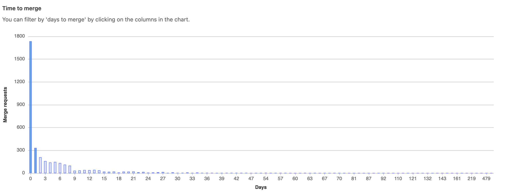
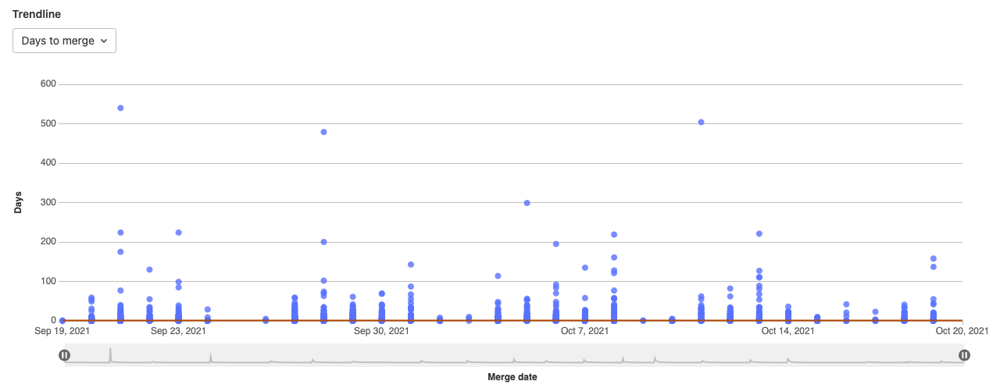
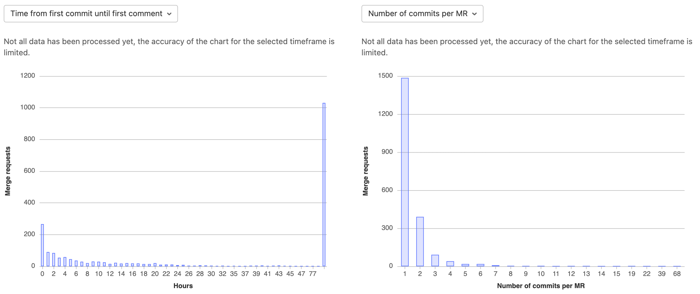

# Productivity Analytics **(PREMIUM)**

> [Introduced](https://gitlab.com/gitlab-org/gitlab/-/issues/12079) in GitLab 12.3.

Track development velocity with Productivity Analytics.

For many companies, the development cycle is a black box and getting an estimate of how
long, on average, it takes to deliver features is an enormous endeavor.

While [Value Stream Analytics](../analytics/value_stream_analytics.md) focuses on the entire
Software Development Life Cycle (SDLC) process, Productivity Analytics provides a way for Engineering Management to drill down in a systematic way to uncover patterns and causes for success or failure at an individual, project, or group level.

Productivity can slow down for many reasons ranging from degrading codebase to quickly growing teams. To investigate, department or team leaders can start by visualizing the time it takes for merge requests to be merged.

## Visualizations and metrics

With Productivity Analytics, GitLab users can:

- Visualize typical merge request (MR) lifetime and statistics. A histogram shows the distribution of the time elapsed between creating and merging merge requests.
- Drill down into the most time consuming merge requests, select outliers, and filter subsequent charts to investigate potential causes.
- Filter by group, project, author, label, milestone, or a specific date range. For example, filter down to the merge requests of a specific author in a group or project during a milestone or specific date range.
- Measure velocity over time. To observe progress, visualize the trends of each metric from the charts over time. Zoom in on a particular date range if you notice outliers.

## Metrics charts

To access the charts, navigate to a group's sidebar and select **Analytics > Productivity Analytics**.
Metrics and visualizations of **merged** merge requests are available on a project or group level.

### Time to merge

The **Time to merge** histogram shows the number of merge requests and the number
of days it took to merge after creation. Select a column to filter subsequent charts.

### Trendline

The **Trendline** scatterplot shows all merge requests on a certain date,
and the days it took to complete the action and a 30 day rolling median. Select the dropdown to view:

- Time from first commit to first comment.
- Time from first comment until last commit.
- Time from last commit to merge.
- Number of commits per merge request.
- Number of lines of code (LOC) per commit.
- Number of files touched.

### Commits and merge request size

Under the **Trendline** scatterplot, the left-side histogram shows
the time taken (in hours) between commits and comments until the merge
request is merged. Select the dropdown to view:

- Time from first commit to first comment.
- Time from first comment until last commit.
- Time from last commit to merge.

The right-side histogram shows the size or complexity of a merge request.
Select the dropdown to view:
  
- Number of commits per merge request.
- Number of lines of code (LOC) per commit.
- Number of files touched.

### Merge request list

The **List** table shows a list of merge requests with their respective time duration metrics.

Sort metrics by:

- Time from first commit to first comment.
- Time from first comment until last commit.
- Time from last commit to merge.

Filter metrics by:

- Number of commits per merge request.
- Number of lines of code per commit.
- Number of files touched.

## Filter by date range

> [Introduced](https://gitlab.com/gitlab-org/gitlab/-/issues/13188) in GitLab 12.4.

You can filter analytics based on a date range. To filter results:

1. Select a group.
1. Optional. Select a project.
1. Select a date range by using the available date pickers.

## Permissions

The **Productivity Analytics** dashboard can be accessed only:

- On [GitLab Premium](https://about.gitlab.com/pricing/) and above.
- By users with at least the Reporter [role](../permissions.md).
