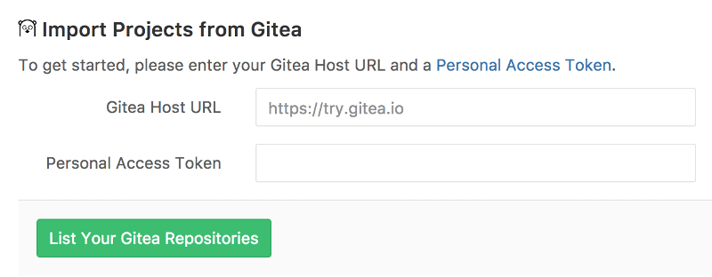

# Import your project from Gitea to GitLab **(FREE)**

Import your projects from Gitea to GitLab with minimal effort.

NOTE:
This requires Gitea `v1.0.0` or later.

The Gitea importer can import:

- Repository description
- Git repository data
- Issues
- Pull requests
- Milestones
- Labels

When importing, repository public access is retained. If a repository is private in Gitea, it's
created as private in GitLab as well.

## How it works

Because Gitea isn't an OAuth provider, author/assignee can't be mapped to users
in your GitLab instance. This means the project creator (usually the user that
started the import process) is set as the author. A reference, however, is kept
on the issue about the original Gitea author.

The importer creates any new namespaces (groups) if they don't exist. If the
namespace is taken, the repository is imported under the user's namespace
that started the import process.

## Import your Gitea repositories

The importer page is visible when you create a new project.

Select the **Gitea** link to start the import authorization process.

### Authorize access to your repositories using a personal access token

With this method, you perform a one-off authorization with Gitea to grant
GitLab access your repositories:

1. Go to `https://your-gitea-instance/user/settings/applications` (replace
   `your-gitea-instance` with the host of your Gitea instance).
1. Select **Generate New Token**.
1. Enter a token description.
1. Select **Generate Token**.
1. Copy the token hash.
1. Go back to GitLab and provide the token to the Gitea importer.
1. Select **List Your Gitea Repositories** and wait while GitLab reads
   your repositories' information. After it's done, GitLab displays the importer
   page to select the repositories to import.

### Select which repositories to import

After you've authorized access to your Gitea repositories, you are
redirected to the Gitea importer page.

From there, you can view the import statuses of your Gitea repositories:

- Those that are being imported show a _started_ status.
- Those already successfully imported are green with a _done_ status.
- Those that aren't yet imported have an **Import** button on the
  right side of the table.

You also can:

- Import all of your Gitea projects in one go by selecting **Import all projects**
  in the upper left corner.
- Filter projects by name. If filter is applied, selecting **Import all projects**
  imports only matched projects.

You can also choose a different name for the project and a different namespace,
if you have the privileges to do so.
